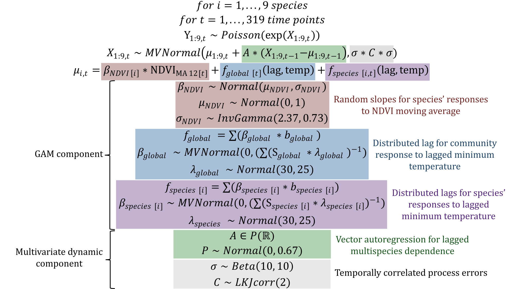

# Beyond single-species models: leveraging multispecies forecasts to navigate the dynamics of ecological predictability

## Summary
This repository contains R code to extract data and replicate analyses in the manuscript titled *Beyond single-species models: leveraging multispecies forecasts to navigate the dynamics of ecological predictability* (currently in review; a preprint of a previous version is hosted on *biorxiv* at the following DOI: [https://doi.org/10.32942/X2TS34](https://doi.org/10.32942/X2TS34)). This work shows how to build and interrogate multivariate Dynamic Generalized Additive Models (DGAMs) that can simultaneously learn useful multispecies dependencies and shared environmental effects, while also producing reliable probabilistic forecasts (the core model of the paper is presented in its full mathematical form above).

## Required R libraries
`portalcasting`  
`tidyverse`   
`forecast`  
`cmdstanr` (and `Cmdstan`)  
[`mvgam`](https://github.com/nicholasjclark/mvgam)  
`scoringRules`  
`extraDistr`  
`nleqslv`

## Workflow
Raw rodent capture and covariate data have already been downloaded from the latest version of the `portalr` database and extracted to the `data` directory. Data can be prepared for analysis / modeling following instructions in the `1.prep_data.R` script. Models are built using `mvgam` functionality in the `2.models.R` script. A working version of `cmdstanr` is required to condition models on observed data. This script will produce large model objects (stored as class `mvgam`) that unfortunately cannot be uploaded to `Github` due to their size. Analysis of these models is completed in the `3.analysis.R` script. Figures are produced throughout the workflow. All of these figures are stored in the `Figures` directory. 
